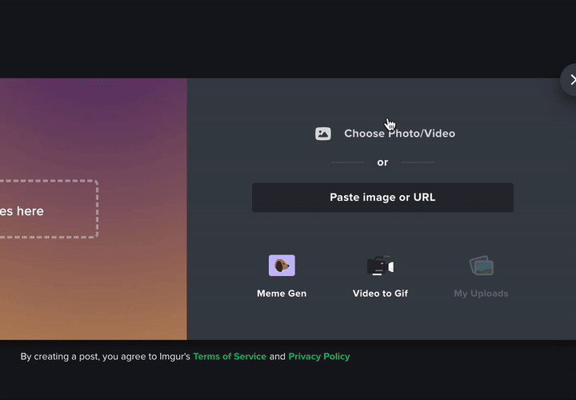
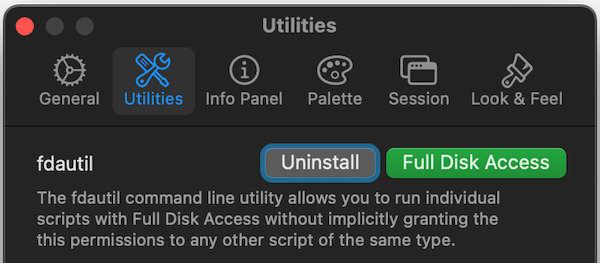
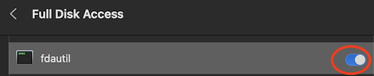

<!-- PROJECT SHIELDS -->
<!--
*** I'm using markdown "reference style" links for readability.
*** Reference links are enclosed in brackets [ ] instead of parentheses ( ).
*** See the bottom of this document for the declaration of the reference variables
*** for contributors-url, forks-url, etc. This is an optional, concise syntax you may use.
*** https://www.markdownguide.org/basic-syntax/#reference-style-links
-->
<!-- could be some extra
[![Contributors][contributors-shield]][contributors-url]
[![Forks][forks-shield]][forks-url]
[![Stargazers][stars-shield]][stars-url]
[![Issues][issues-shield]][issues-url]
-->
![Language: bash][language-shield]
[![pre-commit][pre-commit-shield]][pre-commit-url]
[![MIT License][license-shield]][license-url]
[![LinkedIn][linkedin-shield]][linkedin-url]

# URL file watcher for macOS

Solves an issue of using a direct URL of the file in the upload file dialog on macOS, similar(-ish) as it is implemented on Windows.

## Tech Stack

- Shell script
- [launchd](https://www.launchd.info/)

## Installation

1. [Clone](https://docs.github.com/en/repositories/creating-and-managing-repositories/cloning-a-repository) this repository.

1. Install _LaunchControl_ app in order to have `fdautil` utility installed

    - Install _LaunchControl_ either [from its web-site](https://www.soma-zone.com/LaunchControl/) or via HomeBrew: `brew install launchcontrol`.

    - _LaunchControl_ ships a utility called _fdautil_ which allows you to grant Full Disk Access to a script without compromising Apple's new security feature. The utility can be installed via the LaunchControl preferences Utilities panel.

        

    - When installing fdautil LaunchControl will ask you to add it to the list of programs with Full Disk Access.

        

1. From the cloned repository folder run the _install.sh_: `./install.sh`

    It will modify the [template of a _.plist_ file](./source/input.plist) and copy it to "\~/Library/LaunchAgents/" folder. It will also copy the [actual script](source/url-file-watcher.sh) to "~/.config/scripts/" folder.

## Usage and settings

### Usage

- There will be a "url-file-watcher" folder created on desktop with an empty "url" file in it
- First copy an URL of a file you want to upload elsewhere without "http://" or "https://" part (eg. if an original URL is "http://site.com/file.jpg", copy the "site.com/file.jpg" part of it)
- Select an upload option on the site you want to upload a file to and open a "~/Desktop/url-file-watcher" folder
- Right in the opened dialog rename the "url" file to the part of the URL you've copied previously (eg. rename "url" to "site.com/file.jpg") and press Enter
- Wait few seconds until a new (downloaded) file will appear in the same folder and select it for the upload
- The downloaded file will be removed automatically and an empty "url" file re-created [after few seconds](#settings-optional)

### Settings (optional)

- You can adjust the number of seconds the downloaded file is kept by editing the line `sleep 15` in the "url-file-watcher.sh" file (by default placed to "~/.config/scripts/" folder)

## Credits

- Based on the solution of <https://apple.stackexchange.com/a/409659/396803>
- <https://ss64.com/osx/>
- <https://forum.zettelkasten.de/discussion/comment/8184/#Comment_8184>
- <https://mayeu.me/post/how-to-trigger-any-action-when-a-file-or-folder-changes-on-macos-on-the-cheap/>

## License

Distributed under the [MIT License](./LICENSE).

<!-- MARKDOWN LINKS & IMAGES -->
<!-- https://www.markdownguide.org/basic-syntax/#reference-style-links -->
[language-shield]: https://img.shields.io/badge/-Made%20with%20Bash-green?logo=gnu-bash&logoColor=black&style=flat
[pre-commit-shield]: https://img.shields.io/badge/pre--commit-enabled-brightgreen?logo=pre-commit&style=flat
[pre-commit-url]: https://github.com/pre-commit/pre-commit
[license-shield]: https://img.shields.io/github/license/andrejkurusiov/url-file-watcher?style=flat
[license-url]: ./LICENSE
[linkedin-shield]: https://img.shields.io/badge/LinkedIn-Profile-informational?style=flat&logo=linkedin
[linkedin-url]: https://www.linkedin.com/in/andrejkurusiov/
